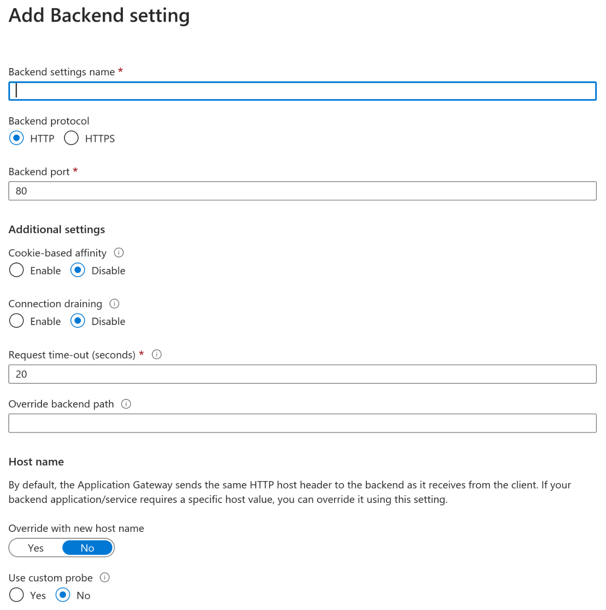
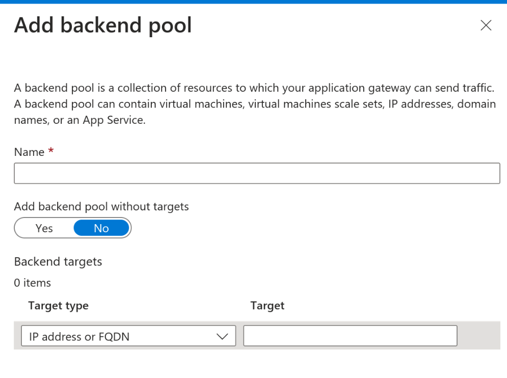

In today's microservice-oriented era, backend developers often find themselves
taking on DevOps tasks. However, let's face the truth - being a DevOps engineer
is a trade of its own, with which software developers usually have limited
familiarity. While developers can manage basic tasks, they can quickly find
themselves out of their comfort zone when faced with more complex challenges.

I recently found myself in this very situation. Having successfully set up
multiple Kubernetes clusters in Azure, Google Cloud, and other platforms using
various automation techniques, I was confident in my abilities to tackle a new
project. However, this time, the requirements were different. I needed to
automate the process using Terraform, while also incorporating incoming traffic
routing through an Application Gateway and ensuring its security with a Web
Application Firewall.

As I delved into the documentation, I was quickly overwhelmed by the abundance
of information. Navigating through the documentation became a challenge, and I
struggled to take concrete actions. In this blog post, I will share my findings
and experiences, aiming to assist those who may be facing similar hurdles.

All source code can be found in my [GitHub Repository](https://github.com/tluijken/terraform_aks_example).

## Struggles in Setting Up a Firewall for a Kubernetes Cluster

In my initial attempt to set up a firewall for my Kubernetes cluster, I followed
Microsoft's
[article](https://learn.microsoft.com/en-us/azure/firewall/protect-azure-kubernetes-service)
that described the use of a traditional firewall. I managed to successfully
configure the traditional firewall and convert the provided scripts into a
Terraform setup. Additionally, I implemented a [Hub and Spokes
architecture](https://learn.microsoft.com/en-us/azure/architecture/reference-architectures/hybrid-networking/hub-spoke?tabs=cli)
for improved network management.

Nevertheless, I encountered difficulties when attempting to install an nginx
ingress controller using a helm chart, primarily due to [routing
issues](https://github.com/kubernetes/ingress-nginx/issues/7626#issuecomment-944053390).
Surprisingly, the initial Microsoft article did not mention the need to set up
an nginx ingress controller; it only referred to a load balancer service that
directed traffic directly to a single deployment or replica set.

I explored other [useful
resources](https://denniszielke.medium.com/fully-private-aks-clusters-without-any-public-ips-finally-7f5688411184)
in an attempt to find a solution, but unfortunately, I faced the same recurring
issues. It became evident that my knowledge of networking was insufficient to
resolve these challenges.

Feeling stranded, I reached out to my network for support and sought advice from
DevOps engineers on how they typically secure their Kubernetes clusters. Through
these discussions, I quickly learned that an [Application Gateway Ingress
Controller](https://learn.microsoft.com/en-us/azure/application-gateway/ingress-controller-overview)
with a [Web Application
Firewall](https://learn.microsoft.com/en-us/azure/web-application-firewall/ag/ag-overview)
would be a more suitable solution for my needs. The Web Application Firewall
offers valuable features such as packet inspection and bot detection, making it
better suited to protect my services from malicious requests.

With a sense of relief, I decided to leverage the Application Gateway Ingress
Controller along with the Web Application Firewall to enhance the security of my
Kubernetes cluster.

## Setting up a Application Gateway Ingress Controller and Web Application Firewall.

Initially I just enabled the Application Gateway Ingress Controller by checking
the checkbox under 'Network'. After that I also enabled the Web Application
Firewall through the Azure Portal. So far, super easy setup. However, I found
myself searching for answers when setting up the 'Backend pools', 'SSL
settings', 'Listeners and Rules'. How does this translate to traffic into my
cluster? So many options to review:



And what about these 'backend pools', which IP address to I assign? As far as I
could understand from the image, the AGIC would direct traffic directly to the
pods, and those IP's are super dynamic.


I felt lost again in the Azure ecosystem, and needed to get some more
information. Surely, I'm not the first to set this up, why isn't this straight
forward. Surely, [the documentation on the Terraform
registry](https://registry.terraform.io/providers/hashicorp/azurerm/latest/docs/resources/application_gateway)
will indicate quickly how to set this up with easy right?
```terraform
resource "azurerm_resource_group" "example" {
  name     = "example-resources"
  location = "West Europe"
}

resource "azurerm_virtual_network" "example" {
  name                = "example-network"
  resource_group_name = azurerm_resource_group.example.name
  location            = azurerm_resource_group.example.location
  address_space       = ["10.254.0.0/16"]
}

resource "azurerm_subnet" "frontend" {
  name                 = "frontend"
  resource_group_name  = azurerm_resource_group.example.name
  virtual_network_name = azurerm_virtual_network.example.name
  address_prefixes     = ["10.254.0.0/24"]
}

resource "azurerm_subnet" "backend" {
  name                 = "backend"
  resource_group_name  = azurerm_resource_group.example.name
  virtual_network_name = azurerm_virtual_network.example.name
  address_prefixes     = ["10.254.2.0/24"]
}

resource "azurerm_public_ip" "example" {
  name                = "example-pip"
  resource_group_name = azurerm_resource_group.example.name
  location            = azurerm_resource_group.example.location
  allocation_method   = "Dynamic"
}

# since these variables are re-used - a locals block makes this more maintainable
locals {
  backend_address_pool_name      = "${azurerm_virtual_network.example.name}-beap"
  frontend_port_name             = "${azurerm_virtual_network.example.name}-feport"
  frontend_ip_configuration_name = "${azurerm_virtual_network.example.name}-feip"
  http_setting_name              = "${azurerm_virtual_network.example.name}-be-htst"
  listener_name                  = "${azurerm_virtual_network.example.name}-httplstn"
  request_routing_rule_name      = "${azurerm_virtual_network.example.name}-rqrt"
  redirect_configuration_name    = "${azurerm_virtual_network.example.name}-rdrcfg"
}

resource "azurerm_application_gateway" "network" {
  name                = "example-appgateway"
  resource_group_name = azurerm_resource_group.example.name
  location            = azurerm_resource_group.example.location

  sku {
    name     = "Standard_Small"
    tier     = "Standard"
    capacity = 2
  }

  gateway_ip_configuration {
    name      = "my-gateway-ip-configuration"
    subnet_id = azurerm_subnet.frontend.id
  }

  frontend_port {
    name = local.frontend_port_name
    port = 80
  }

  frontend_ip_configuration {
    name                 = local.frontend_ip_configuration_name
    public_ip_address_id = azurerm_public_ip.example.id
  }

  backend_address_pool {
    name = local.backend_address_pool_name
  }

  backend_http_settings {
    name                  = local.http_setting_name
    cookie_based_affinity = "Disabled"
    path                  = "/path1/"
    port                  = 80
    protocol              = "Http"
    request_timeout       = 60
  }

  http_listener {
    name                           = local.listener_name
    frontend_ip_configuration_name = local.frontend_ip_configuration_name
    frontend_port_name             = local.frontend_port_name
    protocol                       = "Http"
  }

  request_routing_rule {
    name                       = local.request_routing_rule_name
    rule_type                  = "Basic"
    http_listener_name         = local.listener_name
    backend_address_pool_name  = local.backend_address_pool_name
    backend_http_settings_name = local.http_setting_name
  }
}
```
...But perhaps not.

## The Hidden Key
Despite extensive digging through [the
documentation](https://learn.microsoft.com/en-us/azure/application-gateway/tutorial-ingress-controller-add-on-new),
the elusive piece of the puzzle was yet to be found.

The eureka moment arrived when I delved deeper into Microsoft's provided ingress
configuration. I discovered a tiny discrepancy that would pave the path to
success.

```yaml
apiVersion: networking.k8s.io/v1
kind: Ingress
metadata:
  name: aspnetapp
  annotations:
    kubernetes.io/ingress.class: azure/application-gateway
spec:
  rules:
  - http:
      paths:
      - path: /
        backend:
          service:
            name: aspnetapp
            port:
              number: 80
        pathType: Exact
```
Crucial in this context is the ingress.class annotation:
`kubernetes.io/ingress.class: azure/application-gateway`.

As I dived deeper, I observed a pod named 'ingress-appgw-deployment-****'
running in the cluster.

```bash
$ kubectl get pods -n kube-system
NAME                                       READY   STATUS    RESTARTS   AGE
....
ingress-appgw-deployment-85c4dc479-fc6l6   1/1     Running   0          5d20h
...
```
This 'ingress-appgw-deployment' is integrated into the Kubernetes cluster
post-activation of the Application Gateway feature. It effectively manages the
heavy lifting. Depending on the ingress configurations and the
`azure/application-gateway` ingress class, it automates the setup of routing,
backend pools, listeners, and more in the Application Gateway configuration.

With everything now set up correctly, I found myself capable of configuring a
Web Application Firewall, tied to the Application Gateway Ingress Controller.

## Shifting to Terraform

As I sought to configure all elements via Terraform, including firewall rules,
the path forward was not as straightforward as simply enabling the [Application
Gateway Ingress
Controller](https://registry.terraform.io/providers/hashicorp/azurerm/latest/docs/resources/kubernetes_cluster#ingress_application_gateway)
in the AKS cluster node. Given my intention to integrate the Application
Controller with the Web Application Firewall, I was required to first configure
the Web Application Firewall and Application Gateway and then bind them. This
process inevitably led me to manually set up the VNET/Subnets in Terraform.
Thankfully, my prior experience with the classic Firewall had instilled in me a
strong understanding of networking.

### Resource Group

I began by creating a resource group, which would house all the resources to
configure, except for the ones automatically created for the AKS cluster by
Azure itself.

```terraform
resource "azurerm_resource_group" "aks-appgw-demo" {
  name     = "aks-appgw-demo-rg"
  location = "westeurope"
}
```

### Web Application Firewall

With the resource group established, the next step was to set up the Web
Application Firewall Policy:

```terraform
resource "azurerm_web_application_firewall_policy" "aks-appgw-demo" {
  name                = "web-application-firewall"
  location            = azurerm_resource_group.aks-appgw-demo.location
  resource_group_name = azurerm_resource_group.aks-appgw-demo.name
  depends_on          = [azurerm_resource_group.aks-appgw-demo]

  policy_settings {
    enabled                     = true
    file_upload_limit_in_mb     = 100
    max_request_body_size_in_kb = 128
    mode                        = "Detection"
    request_body_check          = true
  }

  managed_rules {
    managed_rule_set {
      type    = "OWASP"
      version = "3.2"
    }

    managed_rule_set {
      type    = "Microsoft_BotManagerRuleSet"
      version = "1.0"
    }
  }
}
```
This basic configuration defines rudimentary rules for a Web Application
Firewall, including OWASP rules and Bot Detection Rules.

### Networking

Before the Application Gateway can be established, I had to manage some
networking prerequisites. These subnets would eventually be allocated to the
Application Gateway resource and the AKS cluster. To simplify modifications, I
created some local values.

```terraform
locals {
  vnet_address_space          = "10.224.0.0/15" # Ranges 10.224.0.1 till 10.225.255.254
  aks_subnet_address_prefix   = "10.224.0.0/16" # Ranges 10.224.0.1 till 10.224.255.254
  appgw_subnet_address_prefix = "10.225.0.0/16" # Ranges 10.225.0.1 till 10.225.255.254
  appgw_private_ip_address    = "10.225.0.100"  # Should reside in the appgw-subnet range
}
```

Next came the implementation of my network configuration.

```terraform
resource "azurerm_virtual_network" "aks-gw-vnet" {
  name                = "AksVnet"
  location            = azurerm_resource_group.aks-appgw-demo.location
  resource_group_name = azurerm_resource_group.aks-appgw-demo.name
  depends_on          = [azurerm_resource_group.aks-appgw-demo]
  address_space       = [local.vnet_address_space]
}
resource "azurerm_subnet" "aks" {
  name                 = "aks-subnet"
  resource_group_name  = azurerm_resource_group.aks-appgw-demo.name
  depends_on           = [azurerm_resource_group.aks-appgw-demo, azurerm_virtual_network.aks-gw-vnet]
  virtual_network_name = azurerm_virtual_network.aks-gw-vnet.name
  address_prefixes     = [local.aks_subnet_address_prefix]
}

resource "azurerm_subnet" "application_gateway" {
  name                 = "ingress-appgateway-subnet"
  resource_group_name  = azurerm_resource_group.aks-appgw-demo.name
  depends_on           = [azurerm_resource_group.aks-appgw-demo, azurerm_virtual_network.aks-gw-vnet]
  virtual_network_name = azurerm_virtual_network.aks-gw-vnet.name
  address_prefixes     = [local.appgw_subnet_address_prefix]
}
```

Additionally, I needed a public IP address to assign as the public IP address for the Application Gateway.

```terraform
resource "azurerm_public_ip" "aks_appgw-demo" {
  name                = "appgw_public_ip"
  location            = azurerm_resource_group.aks-appgw-demo.location
  resource_group_name = azurerm_resource_group.aks-appgw-demo.name
  depends_on          = [azurerm_resource_group.aks-appgw-demo]
  allocation_method   = "Static"
  sku                 = "Standard"
}
```
### Application Gateway
Finally, I was ready to set up an Application Gateway. However, this part
introduced some confusion. I was required to define at least one `backend_pool`,
`http_backend_settings`, `http_listener`, and `request_routing_rule`. These
requirements seemed nonsensical since they would be replaced by my `app-gw` pod
during the synchronization process.

I filled them with placeholder data, knowing that they would be deleted and
replaced with relevant configurations later. This brought up another issue: once
the `app-gw` pod starts setting configurations to the Application Gateway, the
configuration no longer matches my state file. Running `terraform apply` at that
point would result in recreating the resource, reverting back to my placeholder
configuration. To avoid this, I included some filters for 'lifecycle
management'.

```terraform
resource "azurerm_application_gateway" "aks-appgw-demo" {
  name                = "application-gateway"
  location            = azurerm_resource_group.aks-appgw-demo.location
  resource_group_name = azurerm_resource_group.aks-appgw-demo.name
  depends_on          = [azurerm_resource_group.aks-appgw-demo, azurerm_web_application_firewall_policy.aks-appgw-demo, azurerm_subnet.application_gateway, azurerm_public_ip.aks_appgw-demo]
  firewall_policy_id  = azurerm_web_application_firewall_policy.aks-appgw-demo.id

  sku {
    name     = "WAF_v2"
    tier     = "WAF_v2"
    capacity = 2
  }

  gateway_ip_configuration {
    name      = "gateway-ip-configuration"
    subnet_id = azurerm_subnet.application_gateway.id
  }

  frontend_port {
    name = "port_80"
    port = 80
  }

  # Assign the public IP to the application gateway
  frontend_ip_configuration {
    name                 = "AppGwPublicFrontendIp"
    public_ip_address_id = azurerm_public_ip.aks_appgw-demo.id
  }

  frontend_ip_configuration {
    name                          = "PrivateFrontendIp"
    private_ip_address            = local.appgw_private_ip_address
    private_ip_address_allocation = "Static"
    subnet_id                     = azurerm_subnet.application_gateway.id
  }

  # Initial placeholder configuration for backend, listeners, rules.
  # These are required for setting up the application gateway.
  # In the aks cluster, a synchronization pod will be created,
  # which will update the application gateway's
  # listeners, back-ends, and rules in line with the ingress configuration.
  # This will eventually remove the placeholder items created here.
  backend_address_pool {
    name = "dummyBackend"
  }

  backend_http_settings {
    name                  = "dummyBackendSettings"
    cookie_based_affinity = "Disabled"
    path                  = "/path1/"
    port                  = 80
    protocol              = "Http"
    request_timeout       = 60
  }

  http_listener {
    name                           = "dummyListener"
    frontend_ip_configuration_name = "PrivateFrontendIp"
    frontend_port_name             = "port_80"
    protocol                       = "Http"
  }

  request_routing_rule {
    name                       = "dummyRule"
    rule_type                  = "Basic"
    http_listener_name         = "dummyListener"
    backend_address_pool_name  = "dummyBackend"
    backend_http_settings_name = "dummyBackendSettings"
    priority                   = 100
  }

  # Since the rules, listeners, and backends are dynamically updated at runtime
  # by the application gateway pod, based on the ingress configuration, I've chosen
  # to ignore these changes for lifecycle management.
  lifecycle {
    ignore_changes = [
      backend_address_pool,
      http_listener,
      backend_http_settings,
      request_routing_rule,
      probe,
      redirect_configuration,
      url_path_map,
      ssl_certificate,
      frontend_port,
      tags
    ]
  }
}
```

### AKS Cluster
With the Network, Web Application Firewall, and Application Gateway in place, I can finally add the AKS cluster to my terraform configuration.

This configuration is quite basic, but there are some important settings to note:
* `node_resource_group` - the name I want to assign to the resource group that Azure will create for the AKS resources. This is a personal preference, but I want to have control over this.
* `default_node_pool` > `vnet_subnet_id` - here, I assign our preconfigured subnet to the AKS-cluster node pool.
* `ingress_application_gateway` - this is where I connect the Application Gateway to the AKS cluster.

```terraform
resource "azurerm_kubernetes_cluster" "aks" {
  name                = "app_gw_demo"
  location            = azurerm_resource_group.aks-appgw-demo.location
  resource_group_name = azurerm_resource_group.aks-appgw-demo.name
  depends_on          = [azurerm_resource_group.aks-appgw-demo, azurerm_application_gateway.aks-appgw-demo]
  dns_prefix          = "aks-appgw-demo"

  role_based_access_control_enabled = true
  node_resource_group               = "${azurerm_resource_group.aks-appgw-demo.name}-aks-nodes"

  default_node_pool {
    name            = "default"
    node_count      = 2
    vm_size         = "Standard_DS2_v2"
    os_disk_size_gb = 30
    # Deploy the AKS cluster into the existing virtual network.
    vnet_subnet_id = azurerm_subnet.aks.id
  }

  identity {
    type = "SystemAssigned"
  }

  ingress_application_gateway {
    # Connect the AKS cluster to the gateway
    gateway_id = azurerm_application_gateway.aks-appgw-demo.id
  }
}
```
