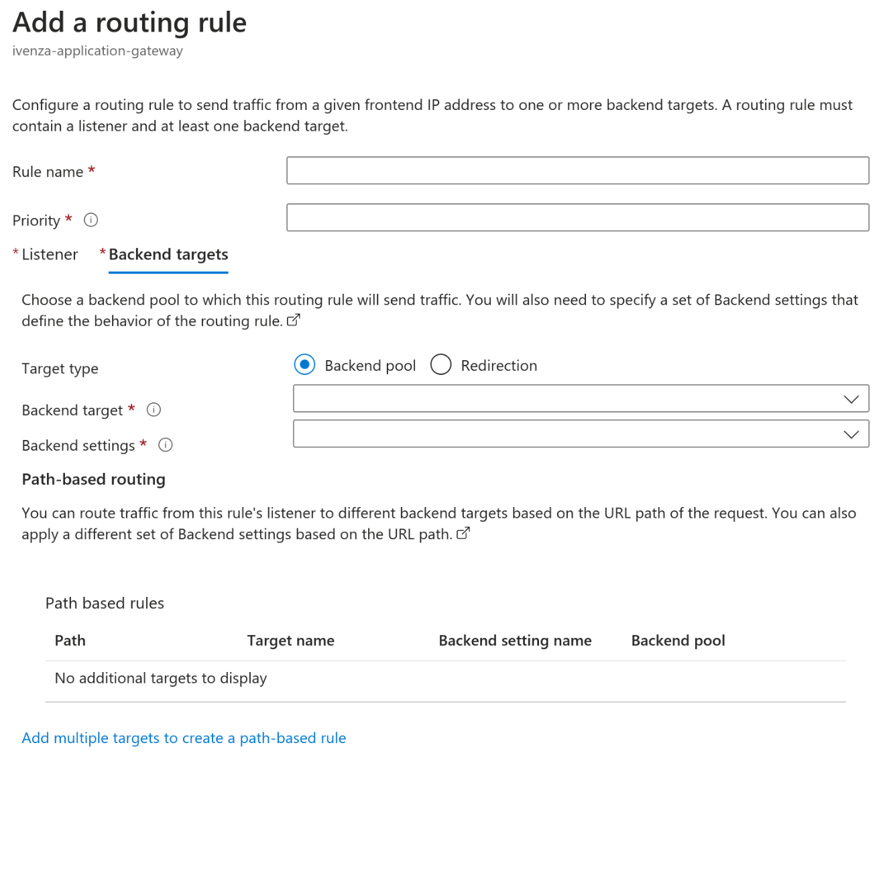

In today's microservice-oriented era, backend developers often find themselves
taking on DevOps tasks. However, let's face the truth - being a DevOps engineer
is a trade of its own, with which software developers usually have limited
familiarity. While developers can manage basic tasks, they can quickly find
themselves out of their comfort zone when faced with more complex challenges.

I recently found myself in this very situation. Having successfully set up
multiple Kubernetes clusters in Azure, Google Cloud, and other platforms using
various automation techniques, I was confident in my abilities to tackle a new
project. However, this time, the requirements were different. I needed to
automate the process using Terraform, while also incorporating incoming traffic
routing through an Application Gateway and ensuring its security with a Web
Application Firewall.

As I delved into the documentation, I was quickly overwhelmed by the abundance
of information. Navigating through the documentation became a challenge, and I
struggled to take concrete actions. In this blog post, I will share my findings
and experiences, aiming to assist those who may be facing similar hurdles.

## Struggles in Setting Up a Firewall for a Kubernetes Cluster

In my initial attempt to set up a firewall for my Kubernetes cluster, I followed
Microsoft's
[article](https://learn.microsoft.com/en-us/azure/firewall/protect-azure-kubernetes-service)
that described the use of a traditional firewall. I managed to successfully
configure the traditional firewall and convert the provided scripts into a
Terraform setup. Additionally, I implemented a [Hub and Spokes
architecture](https://learn.microsoft.com/en-us/azure/architecture/reference-architectures/hybrid-networking/hub-spoke?tabs=cli)
for improved network management.

Nevertheless, I encountered difficulties when attempting to install an nginx
ingress controller using a helm chart, primarily due to [routing
issues](https://github.com/kubernetes/ingress-nginx/issues/7626#issuecomment-944053390).
Surprisingly, the initial Microsoft article did not mention the need to set up
an nginx ingress controller; it only referred to a load balancer service that
directed traffic directly to a single deployment or replica set.

I explored other [useful
resources](https://denniszielke.medium.com/fully-private-aks-clusters-without-any-public-ips-finally-7f5688411184)
in an attempt to find a solution, but unfortunately, I faced the same recurring
issues. It became evident that my knowledge of networking was insufficient to
resolve these challenges.

Feeling stranded, I reached out to my network for support and sought advice from
DevOps engineers on how they typically secure their Kubernetes clusters. Through
these discussions, I quickly learned that an [Application Gateway Ingress
Controller](https://learn.microsoft.com/en-us/azure/application-gateway/ingress-controller-overview)
with a [Web Application
Firewall](https://learn.microsoft.com/en-us/azure/web-application-firewall/ag/ag-overview)
would be a more suitable solution for my needs. The Web Application Firewall
offers valuable features such as packet inspection and bot detection, making it
better suited to protect my services from malicious requests.

With a sense of relief, I decided to leverage the Application Gateway Ingress
Controller along with the Web Application Firewall to enhance the security of my
Kubernetes cluster.

## Setting up a Application Gateway Ingress Controller and Web Application Firewall.

Initially I just enabled the Application Gateway Ingress Controller by checking
the checkbox under 'Network'. After that I also enabled the Web Application
Firewall through the Azure Portal. So far, super easy setup. However, I found
myself searching for answers when setting up the 'Backend pools', 'SSL
settings', 'Listeners and Rules'. How does this translate to traffic into my
cluster? So many options to review:



And what about these 'backend pools', which IP address to I assign? As far as I
could understand from the image, the AGIC would direct traffic directly to the
pods, and those IP's are super dynamic.


I felt lost again in the Azure ecosystem, and needed to get some more
information. Surely, I'm not the first to set this up, why isn't this straight
forward. Surely, [the documentation on the Terraform
registry](https://registry.terraform.io/providers/hashicorp/azurerm/latest/docs/resources/application_gateway)
will indicate quickly how to set this up with easy right?
```terraform
resource "azurerm_resource_group" "example" {
  name     = "example-resources"
  location = "West Europe"
}

resource "azurerm_virtual_network" "example" {
  name                = "example-network"
  resource_group_name = azurerm_resource_group.example.name
  location            = azurerm_resource_group.example.location
  address_space       = ["10.254.0.0/16"]
}

resource "azurerm_subnet" "frontend" {
  name                 = "frontend"
  resource_group_name  = azurerm_resource_group.example.name
  virtual_network_name = azurerm_virtual_network.example.name
  address_prefixes     = ["10.254.0.0/24"]
}

resource "azurerm_subnet" "backend" {
  name                 = "backend"
  resource_group_name  = azurerm_resource_group.example.name
  virtual_network_name = azurerm_virtual_network.example.name
  address_prefixes     = ["10.254.2.0/24"]
}

resource "azurerm_public_ip" "example" {
  name                = "example-pip"
  resource_group_name = azurerm_resource_group.example.name
  location            = azurerm_resource_group.example.location
  allocation_method   = "Dynamic"
}

# since these variables are re-used - a locals block makes this more maintainable
locals {
  backend_address_pool_name      = "${azurerm_virtual_network.example.name}-beap"
  frontend_port_name             = "${azurerm_virtual_network.example.name}-feport"
  frontend_ip_configuration_name = "${azurerm_virtual_network.example.name}-feip"
  http_setting_name              = "${azurerm_virtual_network.example.name}-be-htst"
  listener_name                  = "${azurerm_virtual_network.example.name}-httplstn"
  request_routing_rule_name      = "${azurerm_virtual_network.example.name}-rqrt"
  redirect_configuration_name    = "${azurerm_virtual_network.example.name}-rdrcfg"
}

resource "azurerm_application_gateway" "network" {
  name                = "example-appgateway"
  resource_group_name = azurerm_resource_group.example.name
  location            = azurerm_resource_group.example.location

  sku {
    name     = "Standard_Small"
    tier     = "Standard"
    capacity = 2
  }

  gateway_ip_configuration {
    name      = "my-gateway-ip-configuration"
    subnet_id = azurerm_subnet.frontend.id
  }

  frontend_port {
    name = local.frontend_port_name
    port = 80
  }

  frontend_ip_configuration {
    name                 = local.frontend_ip_configuration_name
    public_ip_address_id = azurerm_public_ip.example.id
  }

  backend_address_pool {
    name = local.backend_address_pool_name
  }

  backend_http_settings {
    name                  = local.http_setting_name
    cookie_based_affinity = "Disabled"
    path                  = "/path1/"
    port                  = 80
    protocol              = "Http"
    request_timeout       = 60
  }

  http_listener {
    name                           = local.listener_name
    frontend_ip_configuration_name = local.frontend_ip_configuration_name
    frontend_port_name             = local.frontend_port_name
    protocol                       = "Http"
  }

  request_routing_rule {
    name                       = local.request_routing_rule_name
    rule_type                  = "Basic"
    http_listener_name         = local.listener_name
    backend_address_pool_name  = local.backend_address_pool_name
    backend_http_settings_name = local.http_setting_name
  }
}
```
...But perhaps not.

## The missing link:
I kept digging through [the
documentation](https://learn.microsoft.com/en-us/azure/application-gateway/tutorial-ingress-controller-add-on-new),
but I couldn't find what I was missing.

What was essential to get this properly working was to have the
'ingress-appgw-deployment' pod do all the heavy lifting for us, and use the
ingress controller configurations as usual, with a small change:
```yaml
apiVersion: networking.k8s.io/v1
kind: Ingress
metadata:
  name: aspnetapp
  annotations:
    kubernetes.io/ingress.class: azure/application-gateway
spec:
  rules:
  - http:
      paths:
      - path: /
        backend:
          service:
            name: aspnetapp
            port:
              number: 80
        pathType: Exact
```
The ingress.class annotation is essential here:
`    kubernetes.io/ingress.class: azure/application-gateway`


